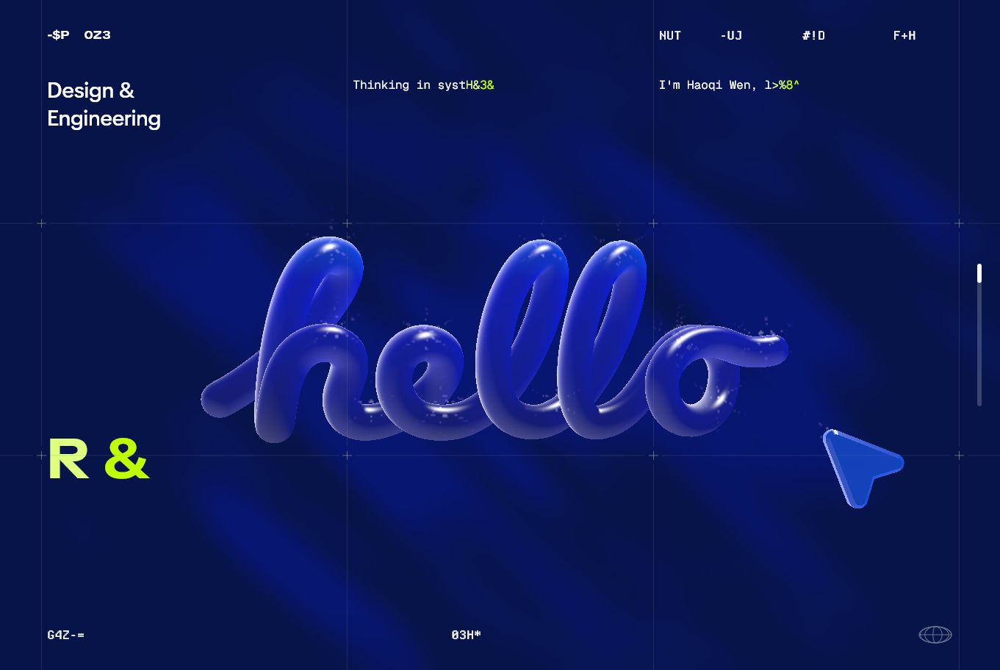
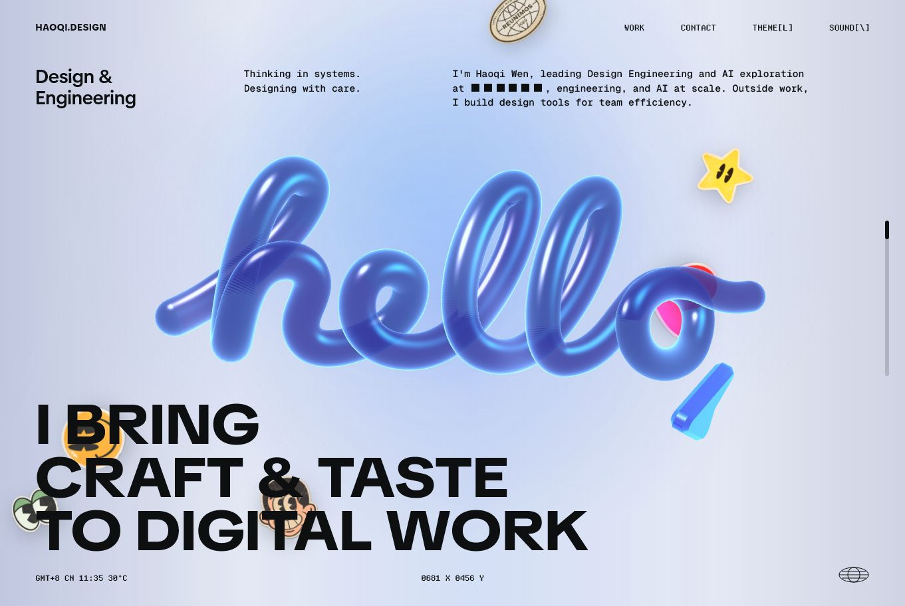

# Hello Design / Haoqi Design Clone

[English README](docs/en/README.md)

这是一个基于 [Haoqi Wen](https://haoqi.design/) 个人网站视觉语言的高保真复刻实验，重点复刻 `haoqi.design` 首页中的玻璃/液体 3D 字体、背景幕布光影、表情贴纸飘落、鼠标交互、滚动叙事和箭头转场效果。

我非常尊重原作者 Haoqi Wen 的设计与工程表达。本项目不是原创设计声明，也不是商业化模板，而是一次学习型复刻：通过拆解和重建原网站中的视觉系统，练习 WebGL、FBO 折射、Three.js、Canvas 2D、滚动叙事和交互动效编排，并在此基础上加入了一些自己的实现和整理。

原作者 Haoqi Wen 在 X 上发布了他的个人网站：[x.com/wenhaoqi/status/2068327540595552355](https://x.com/wenhaoqi/status/2068327540595552355)。发布之后，社区里已经有不少人围绕这个网站进行了学习和复刻。本仓库会尽量清楚标注参考来源，避免让项目看起来像未署名搬运。

## 链接

- 原版网站：[haoqi.design](https://haoqi.design/)
- 复刻主页：[xiaogoulingdi.github.io/hellodesign](https://xiaogoulingdi.github.io/hellodesign/)
- 原作者主页：[Haoqi Wen](https://haoqi.design/)
- 参考发布：[Haoqi Wen on X](https://x.com/wenhaoqi/status/2068327540595552355)
- 原作者作品页示例：[Inspire Mono](https://haoqi.design/inspire_mono)、[WASM Design Utils](https://haoqi.design/wasm_design_utils)

## 首页对比


## 原版首页截图



## 复刻版首页截图



## 复刻重点

- 玻璃/液体感 3D `hello` 字体
- 背景幕布光影与轻微波动
- 表情贴纸飘落和局部涟漪反馈
- 鼠标像素尾影和局部交互
- 由箭头驱动的滚动转场与文字显现
- DOM、Canvas、WebGL、FBO 多层合成

## 技术栈

- Vite
- Three.js
- Native ES modules
- Canvas 2D screen-space effects
- CSS / semantic HTML
- Virtual scroll timeline

## 项目结构

```text
src/
  index.html
  styles.css
  assets/
    audio/
    fonts/
    images/
    models/
    stickers/
    work/
  scripts/
    main.js
    config/
    layers/
    state/
    ui/
    utils/
```

## 本地开发

```bash
npm install
npm run dev
```

默认打开：

```text
http://127.0.0.1:5173/
```

生产构建：

```bash
npm run build
npm run serve
```

构建输出位于 `dist/`。

## 说明

本仓库是学习与研究用途的复刻项目。请尊重原作者的设计与版权，不要将原站下载素材、私有资源、完整生产 bundle 或未经授权的内容用于商业发布。

如果原作者认为本项目的展示方式不合适，我愿意进一步调整署名、说明或下架相关展示内容。

